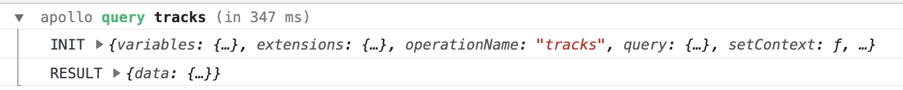
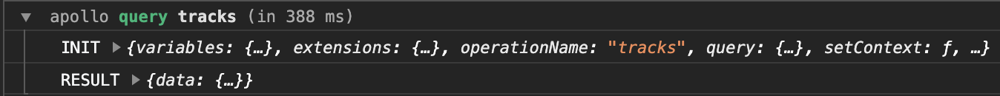
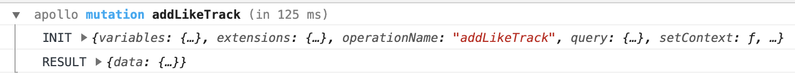
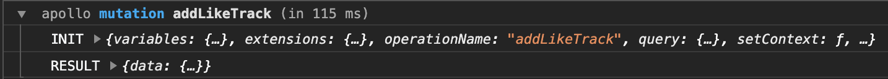
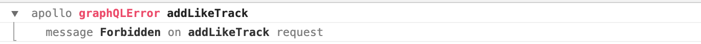
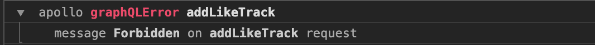
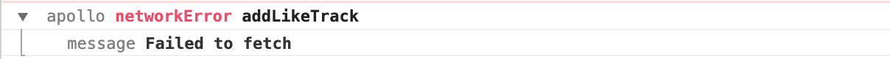
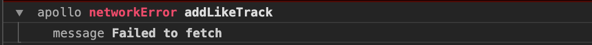

# the-apollo-utilities

> Custom apollo links for use with ApolloGraphQL's apollo client

## What's included?

**queryLogger**

Logger for graphQL queries and mutations. Includes performance information.

**errorLogger**

Logger for graphQL and network errors

### Prerequisites

- Apollo Link.

### Usage

```javascript
import { errorLogger, queryLogger } from "the-apollo-utilities";

// ...
ApolloLink.from([
  errorLogger,
  queryLogger,
  // ...
]);
```

## Screenshots

### Query (expanded):




### Mutation (expanded):




### GraphQL Error (expanded):




### Network Error (expanded):



